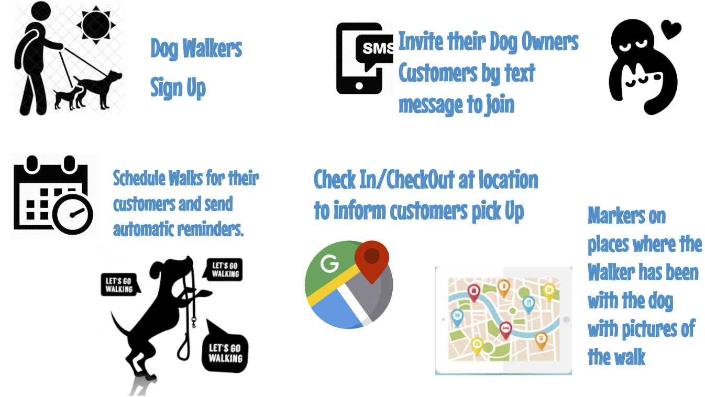
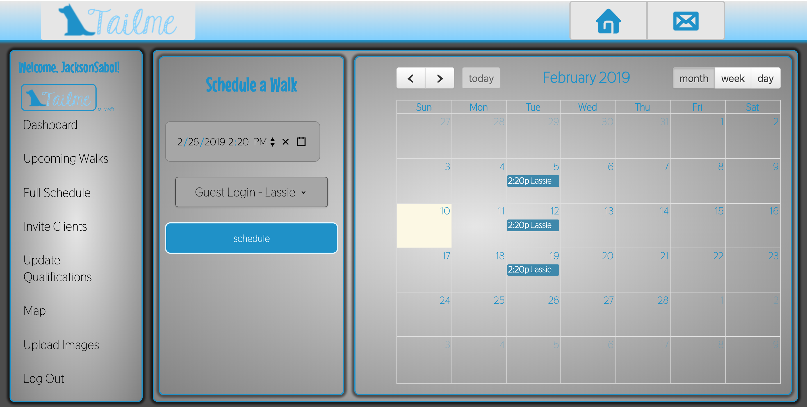

# 

## *A Management System Designed for Dog Walkers*

### The following project is a collaboration built with React.js to provide professional dog walkers a better way to manage their own business.

TailME is a service for professional dog walkers, dedicated to providing a premium experience to their clients, better and easier management of their business, and keeping puppies happy and well exercised. Here at TailME, we know the challenges of running a small business that you love, and we strive to facilitate you keeping those schedules filled and your clientele satisfied. To that end, we've developed a tool that allows you to intake chosen users, interact with them more meaningfully, manage accounts with greater effeciency and, if you choose, grow your business. Join us and help keep more healthy tails wagging!

# 


We employed HTML, CSS, SASS, JavaScript, Yarn, React.js, Express.js, Passport.js, Google Maps, Cron Jobs, Twilio, MySQL, and Sequelize to make this application. All of the task-specific React components are rendered when each page loads, and when the Class state changes on each page. User's are logged in, and their sensitive information is kept stateless, using JSON web tokens with an Express server with Passport.js handling the authentication.

### Usage:

* Visit the link to our deployed application at the bottom of this README, or at the top of the GitHub page

* Peruse the site as you please, but to get started with managing your dog-walking business, click the 'walker sign up' button.
    * Follow the steps to sign up and create a profile
    * Once you've created a profile, update any qualifications you might find relevant to your clients. This and every other feature is accessible through the side navigation bar.
    * Invite your clients to sign up! They'll receive a text message with the link and referral code to sign up with. They will automatically be linked to you when they sign up!
* Leave the hard part to us! Make use of our scheduling system and calendar that's fully editable, check in and out of your walks when they come up, and send photos during your walks so your clients know their babies are safe. Our application pulls geolocation data from the photos you take to show your client the photo at the location where it was taken!

## 

 React's Component-based, functional programming allows web developers to minimize the amount of work each file does, making the application more efficient, easily editable, and making live updates possible. In this application, We utilized ECMA6 classes to define components that render specific snippets of HTML, CSS, and JavaScript. The App component responsible for rendering all of the sub-components handles the front end routing, while individual smart components dedicated to dog-walkers and dog-owners handle logic of the applicaiton, using the object 'state' to track data and pass props to the corresponding sub-components:

 ``` javascript
class WalkerSignup extends Component {
    state = {
        username: '',
        email: '',
        password: '',
        unregistered: true,
        showError: false,
        registerError: false,
        loginError: false
    };
    handleInputChange = event => {
        let value = event.target.value;
        const name = event.target.name;
        if (name === "username") {
            value = value.substring(0, 25);
        }
        this.setState({
            [name]: value
        });
    };
    handleRegisterUser = event => {
        event.preventDefault();
        if (this.state.username === '' || this.state.password === '' || this.state.email === '') {
            this.setState({
                showError: true,
                registerError: true
            });
        } else {
            axios
                .post('/signup', {
                    email: this.state.email,
                    username: this.state.username,
                    password: this.state.password
                })
                .then(response => {
                    this.setState({
                        unregistered: false,
                        showError: false,
                        loginError: false,
                        registerError: false,
                    });
                })
        }
    }
}
 ```
 ``` javascript
 render() {
        const {
            username,
            unregistered,
            showError,
            registerError,
            loginError
        } = this.state;

        if (unregistered) {
            return (
                <div className="walkerSignup">
                </img>
                    <p className="walkerSignup__title"> {title}</p>
                    <form className="walkerSignup__form" onSubmit={this.handleRegisterUser}>
                    <label className="walkerSignup__form--emailLabel">Enter your Email</label>
                        <input className="walkerSignup__form--emailInput"
                            type="email"
                            name="email"
                            value={this.state.email}
                            onChange={this.handleInputChange}
                            placeholder="john.doe@gmail.com"
                        />
                        <label className="walkerSignup__form--usernameLabel">Choose your user name</label>
                        <input className="walkerSignup__form--usernameInput"
                            type="text"
                            name="username"
                            value={this.state.username}
                            onChange={this.handleInputChange}
                            placeholder="UserName"
                        />
                        <label className="walkerSignup__form--passwordLabel">Choose your password</label>
                        <input className="walkerSignup__form--passwordInput"
                            type="password"
                            name="password"
                            value={this.state.password}
                            onChange={this.handleInputChange}
                            placeholder="Password"
                        />
                        <button type="submit" className="walkerSignup__form--submitButton">Register</button>
                    </form>
                    {showError === true && registerError === true && (
                        <div>
                            <p className="walkerSignup__form--alertOne">
                            Username, password, and email are required fields.</p>
                        </div>
                    )}
                    {showError === true && loginError === true && (
                        <div>
                            <p className="walkerSignup__form--alertTwo">
                            That username is already taken. Please choose another, or login.</p>
                            <p><a className="walkerSignup__form--alertButton" href="/user/login">Login</a></p>
                        </div>
                    )}
                    <a className="walkerSignup__form--homeButton" href="/">
                    
                    </img> Home</a>
                    <div className="walkerSignup__form--footer">
                    <Footer/>
                    </div>
                </div>
            );
        } else {
            return <Redirect to={`/walker/create/${username}`} />;
        }
    }
 ```

## Built With
* HTML5 & CSS3
* SAASS
* JavaScript
* Node.js
* Express.js
* Express-routes
* React.js
* Json
* Cron Jobs

## Yarn Packages Used
```
* axios
* bcrypt-nodejs
* body-parser
* cloudinary
* dotenv
* Exif 
* fs
* fullCalendar
* google-map-react
* moment
* passport
* react-datetime-picker
* react-dropzone
* react-grid-gallery
* twilio

```
### Feel free to explore the application and get to managing your clients!

[Link to TailMe](https://tail-me.herokuapp.com/)

Thank you for reading!

## Other resources

* [Visual Studio Code](https://code.visualstudio.com/) - The editor used
* [GitHub](https://github.com/) - Version Control
* [Heroku](https://heroku.com) - Deployment

## Versioning

[GitHub](https://github.com/) for versioning. For the versions available, see the [tags on this repository](https://github.com/JacksonSabol/Tail-Me-App). 

### Built With ♥️ by Team TailMe
* [Isabel Arcones](https://www.linkedin.com/in/iarcones/)
* [Vivian Aguilar](https://www.linkedin.com/in/vivian-aguilar-05124250/)
* [Jackson Sabol](https://www.linkedin.com/in/jackson-sabol-77197175/)
* [Michael True](https://www.linkedin.com/in/michaeldtrue/)